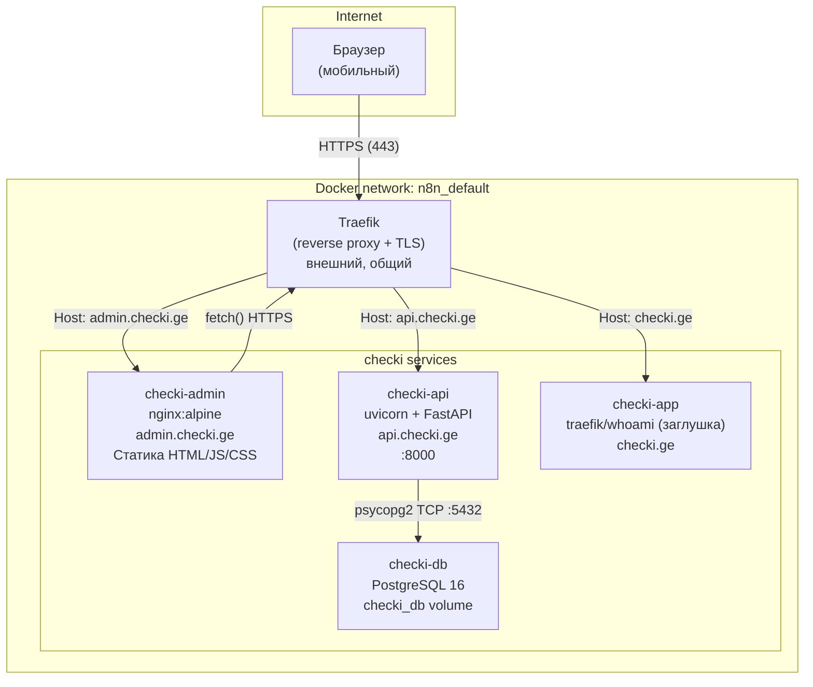
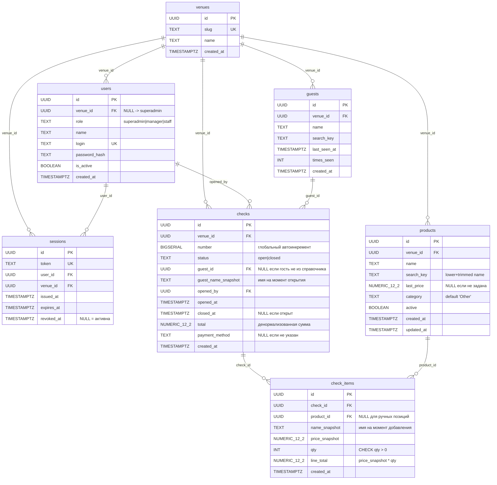
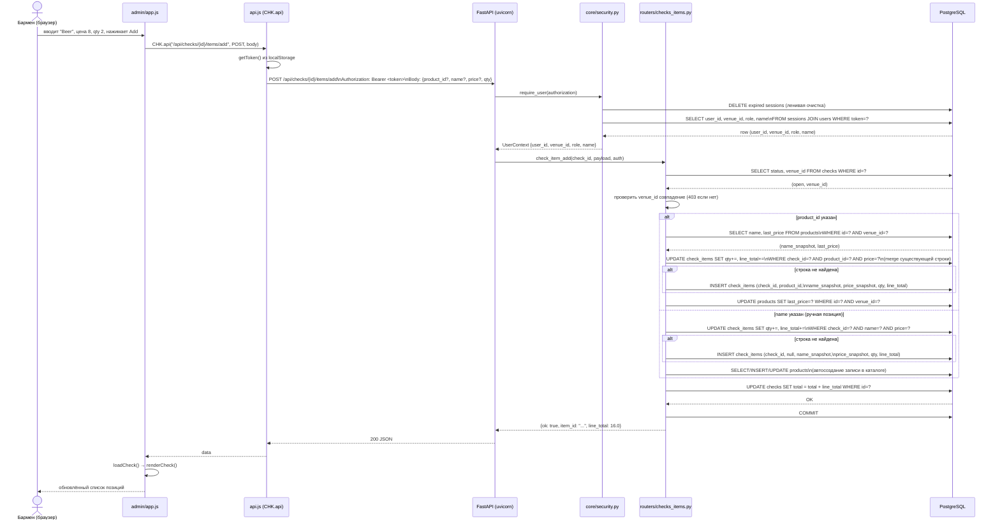
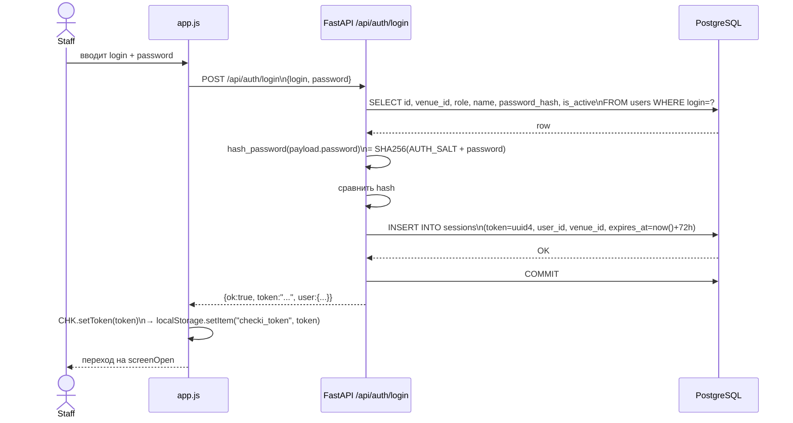

# Checki — Архитектурный обзор

> Версия: 0.0.5 | Дата актуализации: март 2026

---

## Содержание

1. [Обзор архитектуры](#1-обзор-архитектуры)
2. [Схема базы данных](#2-схема-базы-данных)
3. [Карта API](#3-карта-api)
4. [Поток данных](#4-поток-данных)
5. [Модель безопасности](#5-модель-безопасности)
6. [Архитектурные паттерны](#6-архитектурные-паттерны)
7. [Технический долг и рекомендации](#7-технический-долг-и-рекомендации)

---

## 1. Обзор архитектуры

Checki — мобильный веб-интерфейс для управления счётами (чеками) в барах. Архитектура намеренно проста: три контейнера за общим reverse-proxy.

### Высокоуровневая схема



### Стек технологий

| Слой | Технология | Версия |
|---|---|---|
| Runtime | Python | 3.12 |
| Web-фреймворк | FastAPI | 0.115.6 |
| ASGI-сервер | Uvicorn | 0.30.6 |
| БД-адаптер | psycopg2-binary | 2.9.9 |
| База данных | PostgreSQL | 16-alpine |
| Frontend | Vanilla JS (CHK namespace) | — |
| Веб-сервер статики | nginx | alpine |
| Reverse proxy | Traefik | внешний |
| Контейнеризация | Docker Compose | — |

### Структура каталогов

```
checki/
├── backend/
│   ├── Dockerfile
│   ├── requirements.txt          # fastapi, uvicorn, psycopg2-binary
│   └── app/
│       ├── main.py               # FastAPI app, middleware, роутеры
│       ├── core/
│       │   ├── config.py         # Settings dataclass, чтение env vars
│       │   ├── security.py       # hash_password(), require_user() → UserContext
│       │   ├── errors.py         # глобальные exception handlers
│       │   ├── parsers.py        # parse_smart_line() — парсер свободного текста
│       │   └── utils.py          # normalize_key(), short_check_number()
│       ├── db/
│       │   └── conn.py           # db_conn(), db_ok() — только соединение
│       ├── routers/
│       │   ├── auth.py           # /api/auth/*
│       │   ├── bootstrap.py      # /api/bootstrap
│       │   ├── checks_open.py    # /api/checks (open + list)
│       │   ├── checks_items.py   # /api/checks/{id}/items/* + GET /api/checks/{id}
│       │   ├── checks_close.py   # /api/checks/{id}/close
│       │   ├── checks_archive.py # /api/checks/archive
│       │   ├── guests.py         # /api/guests/*
│       │   ├── products.py       # /api/products/*
│       │   └── health.py         # /api/health
│       └── schemas/
│           ├── auth.py           # LoginIn
│           ├── bootstrap.py      # BootstrapIn
│           ├── checks.py         # CheckOpenIn, ItemAddIn, AddLineIn, CheckCloseIn
│           ├── guests.py         # GuestUpsertIn
│           └── products.py       # ProductUpsertIn, ProductOut, ProductListOut
├── admin/                        # Статика (nginx)
│   ├── index.html                # Единственная HTML-страница (SPA)
│   ├── main.js                   # Загрузчик модулей (sequential)
│   ├── api.js                    # CHK.api(), CHK.getToken/setToken
│   ├── ui.js                     # CHK.show(), CHK.toast(), CHK.confirm()
│   ├── archive.js                # CHK.archive.load() — архив чеков
│   ├── app.js                    # Основная логика (legacy, будет разбита)
│   ├── checks.js                 # Заглушка (пустой файл)
│   ├── products.js               # Заглушка (пустой файл)
│   └── app.css
├── sql/
│   ├── 001_init.sql              # Основная схема БД
│   └── 002_sessions.sql          # Таблица sessions
├── tests/
│   ├── conftest.py               # Фикстуры pytest
│   ├── test_auth.py
│   ├── test_checks.py
│   ├── test_parsers.py
│   └── test_products.py
├── docker-compose.yml
├── docker-compose.override.yml   # dev: проброс порта DB 15432
└── pyproject.toml                # ruff, mypy, pytest config
```

---

## 2. Схема базы данных

### ER-диаграмма



### Описание таблиц

#### `venues`
Заведение. Корневой тенант. Все данные изолированы по `venue_id`.

- `slug` — уникальный идентификатор заведения для человека (например, `my-bar`)
- `name` — отображаемое название

#### `users`
Пользователи системы. Роли: `superadmin` (без venue), `manager`, `staff`.

- `venue_id NULL` — разрешён только для суперадмина
- `password_hash` — SHA-256 от `AUTH_SALT + password`
- `is_active` — мягкая блокировка (403 при попытке входа)

#### `sessions`
Сессионные токены (Bearer-аутентификация).

- `token` — UUID4 hex, 32 символа, уникальный
- `expires_at` — TTL задаётся через `SESSION_TTL_HOURS` (по умолчанию 72 ч.)
- `revoked_at` — установлен при явном logout
- Очистка expired-сессий происходит лениво: при каждом вызове `require_user()` выполняется `DELETE ... WHERE expires_at < now()`

**Индексы:** `idx_sessions_token (token)`, `idx_sessions_user (user_id)`, `idx_sessions_expires (expires_at)`

#### `products`
Справочник товаров/позиций заведения. Наполняется автоматически при добавлении ручных позиций в чек.

- `search_key` — нормализованное имя (`lower(trim(name))`), используется для дедупликации
- `last_price` — последняя известная цена, предзаполняет форму добавления позиции
- `active` — флаг существует в схеме, но не используется в запросах (техдолг)

**Индекс:** `idx_products_venue_search (venue_id, search_key)`

#### `guests`
Справочник гостей заведения.

- `search_key` — нормализованное имя для дедупликации
- `times_seen` — счётчик появлений, инкрементируется при upsert

**Индекс:** `idx_guests_venue_search (venue_id, search_key)`

#### `checks`
Основная сущность — счёт/чек.

- `number` — `BIGSERIAL`, глобальный автоинкремент (не per-venue). Используется для отображения; `short_check_number()` возвращает первые 8 символов UUID
- `guest_name_snapshot` — имя гостя на момент открытия чека (защита от переименования)
- `total` — денормализованная сумма. Обновляется при каждом изменении позиций. **Не пересчитывается из `check_items`** — это инвариант, который нужно поддерживать вручную
- `status` — `CHECK (status IN ('open','closed'))`, переход необратим

**Индекс:** `idx_checks_venue_status (venue_id, status)`

#### `check_items`
Позиции чека.

- `name_snapshot`, `price_snapshot` — снимки на момент добавления (защита от изменения справочника)
- `line_total = price_snapshot * qty` — хранится явно (финансовая точность)
- `qty CHECK (qty > 0)` — количество всегда положительное; удаление строки происходит при снижении до 0
- `product_id NULL` — для позиций, введённых вручную (не из каталога)

**Индекс:** `idx_items_check (check_id)`

### Триггеры и функции

- `set_updated_at()` — PL/pgSQL триггер на `products BEFORE UPDATE`, обновляет `updated_at`
- `pgcrypto` — расширение подключено, но не используется приложением (только для `gen_random_uuid()`)

---

## 3. Карта API

Базовый URL: `https://api.checki.ge`

Формат ответа всегда JSON. Успех: `{"ok": true, ...}`. Ошибка: `{"ok": false, "error": "..."}`.

### Аутентификация

| Метод | Путь | Auth | Описание |
|---|---|---|---|
| POST | `/api/auth/login` | нет | Вход по логину/паролю. Возвращает `token`, `user` |
| POST | `/api/auth/logout` | Bearer | Отзыв текущей сессии (`revoked_at = now()`) |
| GET | `/api/auth/me` | Bearer | Информация о текущем пользователе |

**Схема запроса `POST /api/auth/login`:**
```json
{ "login": "string", "password": "string" }
```
**Схема ответа:**
```json
{
  "ok": true,
  "token": "uuid4hex",
  "user": { "user_id": "uuid", "venue_id": "uuid", "role": "manager", "name": "...", "issued_at": 1234567890, "ttl_hours": 72 }
}
```

### Чеки — открытие и список

| Метод | Путь | Auth | Описание |
|---|---|---|---|
| POST | `/api/checks/open` | Bearer | Открыть чек (`CheckOpenIn`: `guest_id?`, `guest_name?`) |
| POST | `/api/checks` | Bearer | Алиас: открыть чек (`CheckCreateIn`: `guest`) — совместимость с UI |
| GET | `/api/checks/open` | Bearer | Список открытых чеков текущего venue (limit 50, desc) |
| GET | `/api/checks` | Bearer | Алиас для `/api/checks/open` |

### Чеки — детали и позиции

| Метод | Путь | Auth | Описание |
|---|---|---|---|
| GET | `/api/checks/{check_id}` | Bearer | Детали чека + все позиции |
| POST | `/api/checks/{check_id}/items/add` | Bearer | Добавить позицию (`ItemAddIn`) |
| POST | `/api/checks/{check_id}/add_line` | Bearer | Алиас: добавить позицию через `AddLineIn` (строка или name+price+qty) |
| POST | `/api/checks/{check_id}/items/{item_id}/qty` | Bearer | Изменить количество: `?delta=N` (от -99 до 99). Delta=0 — noop. Qty<=0 — удалить строку |

### Чеки — закрытие и архив

| Метод | Путь | Auth | Описание |
|---|---|---|---|
| POST | `/api/checks/{check_id}/close` | Bearer | Закрыть чек. Body опционален: `{"payment_method": "..."}` |
| GET | `/api/checks/archive` | Bearer | Архив закрытых чеков с пагинацией и фильтрами |

**Query-параметры `/api/checks/archive`:**

| Параметр | Тип | Описание |
|---|---|---|
| `from` | `str` | Дата от (YYYY-MM-DD), включительно |
| `to` | `str` | Дата до (YYYY-MM-DD), включительно |
| `q` | `str` | Поиск по `guest_name_snapshot` или `number` (ILIKE) |
| `limit` | `int` | 1–200, по умолчанию 50 |
| `offset` | `int` | 0–5000, по умолчанию 0 |

### Продукты

| Метод | Путь | Auth | Описание |
|---|---|---|---|
| POST | `/api/products/upsert` | Bearer | Создать или обновить продукт по `search_key = normalize_key(name)` |
| GET | `/api/products` | Bearer | Список продуктов venue. Query: `q` (ILIKE), `category`, `limit` (1–500, default 100) |

### Гости

| Метод | Путь | Auth | Описание |
|---|---|---|---|
| POST | `/api/guests/upsert` | Bearer | Создать или обновить гостя (инкремент `times_seen`) |

### Служебные

| Метод | Путь | Auth | Описание |
|---|---|---|---|
| POST | `/api/bootstrap` | нет | Создать venue + manager-пользователя. Работает только при `BOOTSTRAP_ENABLED=true` |
| GET | `/api/health` | нет | Health check: `{"ok": true, "db": true/false, "ts": unix_timestamp}` |

---

## 4. Поток данных

### Последовательность: добавление позиции в чек



### Последовательность: вход пользователя



---

## 5. Модель безопасности

### Аутентификация

**Механизм:** Bearer-токены (опак, не JWT). Токен — случайный UUID4 hex (32 символа).

**Хранение токена на клиенте:** `localStorage` (`checki_token`). Это стандартный подход для SPA, но имеет риск XSS. Cookie с `HttpOnly` был бы безопаснее.

**Жизненный цикл токена:**
1. Создаётся при успешном `POST /api/auth/login`
2. Привязан к `user_id` и `venue_id` в таблице `sessions`
3. Истекает через `SESSION_TTL_HOURS` (по умолчанию 72 ч., задаётся env-переменной)
4. Отзывается через `POST /api/auth/logout` (устанавливает `revoked_at`)
5. Удаляется лениво: при каждом вызове `require_user()` выполняется `DELETE FROM sessions WHERE revoked_at IS NULL AND expires_at < now()`

**Верификация токена** (`core/security.py::require_user()`):
```python
SELECT s.user_id, s.venue_id, u.role, u.name
FROM sessions s JOIN users u ON u.id = s.user_id
WHERE s.token=%s AND s.revoked_at IS NULL AND s.expires_at > now()
```
Каждый запрос открывает отдельное соединение с БД для проверки токена — нет кэширования.

**Хэширование паролей:** SHA-256 от конкатенации `AUTH_SALT + password`. Соль задаётся через `AUTH_SALT` env-переменную.

> **Уязвимость:** SHA-256 с простой солью не является современным стандартом хэширования паролей. Рекомендуется bcrypt/argon2.

### Изоляция заведений (venue isolation)

Каждый аутентифицированный пользователь несёт `venue_id` в `UserContext`. Все запросы к данным должны фильтровать по `venue_id`.

**Уровень 1 — прямой фильтр (LIST-операции):**
```sql
-- Пример из checks_open.py
SELECT id, opened_at, guest_name_snapshot, total
FROM checks
WHERE venue_id=%s AND status='open'
```

**Уровень 2 — проверка принадлежности (GET/POST по ID):**
```python
# Пример из checks_items.py::check_get()
cur.execute("SELECT id, venue_id, ... FROM checks WHERE id=%s;", (str(check_id),))
row = cur.fetchone()
if str(check_venue_id) != str(venue_id):
    raise HTTPException(status_code=403, detail="forbidden")
```

Этот двухуровневый подход означает, что cross-venue доступ по ID вернёт 403, а не 404 — что технически раскрывает факт существования записи. Это приемлемо для MVP.

**Несоответствие в `checks_close.py`:** В роутере закрытия чека `check_id` принимается как `str`, не `UUID`, и нет `UUID` валидации на входе. Остальные роутеры используют `UUID check_id`. Это незначительная непоследовательность.

### SQL-безопасность

**Принцип:** Только параметризованные запросы через `psycopg2` (`%s` плейсхолдеры). Нет f-строк в SQL.

**Исключение — динамическое построение WHERE:** `checks_archive.py` и `products.py` строят `WHERE`-клаузу динамически через список строк и `join`:

```python
# checks_archive.py — безопасно: user-input идёт только в параметры
where: list[str] = ["venue_id=%s", "status='closed'"]
params: list[Any] = [venue_id]
if q:
    where.append("(guest_name_snapshot ilike %s OR number::text ilike %s)")
    like = f"%{qq}%"  # f-строка содержит только %% обёртку, не user-input
    params.extend([like, like])
where_sql = " and ".join(where)
```

Данный подход безопасен: в SQL-текст попадают только статические строки из кода, а пользовательский ввод всегда передаётся как параметр.

### CORS

```python
# main.py
CORSMiddleware(
    allow_origins=settings.cors_origins,  # из env CORS_ORIGINS
    allow_credentials=True,
    allow_methods=["*"],
    allow_headers=["*"],
)
```

По умолчанию разрешены: `https://admin.checki.ge`, `https://checki.ge`. Задаётся через `CORS_ORIGINS` env-переменную.

### Bootstrap-эндпоинт

`POST /api/bootstrap` — создание venue и первого manager-пользователя — защищён env-флагом `BOOTSTRAP_ENABLED=true`. В production он должен быть отключён (значение по умолчанию — `false`).

---

## 6. Архитектурные паттерны

### Backend

**Router-per-resource (вертикальная нарезка по функции):** Каждый router-файл отвечает за один аспект жизненного цикла чека (`checks_open`, `checks_items`, `checks_close`, `checks_archive`). Это улучшает навигацию и соблюдает правило 250 строк на файл.

**Процедурный стиль без ORM:** Весь доступ к данным — сырой SQL через psycopg2. Нет слоя репозитория, нет абстракции над курсором. Бизнес-логика живёт непосредственно в роутерах. Это сознательный выбор для MVP (меньше абстракций = меньше мест для ошибок в multi-tenant логике).

**Connection-per-request:** `db_conn()` открывает новое psycopg2-соединение на каждый запрос, закрывает в `finally`. Нет пула соединений. Для текущей нагрузки (несколько баров) приемлемо; при росте потребует pgbouncer или asyncpg.

**Паттерн upsert по нормализованному ключу:** `products` и `guests` дедуплицируются по `search_key = normalize_key(name) = lower(trim(name))`. Upsert реализован вручную: сначала `SELECT`, затем `UPDATE` или `INSERT`.

**Snapshot-данные:** `name_snapshot`, `price_snapshot`, `guest_name_snapshot` — фиксируют состояние на момент создания записи. Изменение справочника не затрагивает исторические данные.

**Денормализованный итог чека:** `checks.total` хранится явно и обновляется инкрементально (`total = total + delta`) при каждом изменении позиции. Нет триггера пересчёта; консистентность обеспечивается кодом.

**Ленивая очистка сессий:** `require_user()` выполняет `DELETE FROM sessions WHERE expires_at < now()` при каждом вызове. Это держит таблицу чистой без отдельного cron-джоба.

**Глобальные exception handlers:** `main.py` регистрирует три обработчика (`HTTPException`, `RequestValidationError`, `Exception`) через `add_exception_handler`, что унифицирует формат ошибок.

### Frontend

**CHK namespace:** Все JS-модули пишут в `window.CHK`. Это глобальное пространство имён заменяет ES-модули (которые потребовали бы сборщика или `type="module"` с CORS-ограничениями при работе через `file://`).

**Последовательная загрузка модулей через `main.js`:**
```
main.js → api.js → ui.js → archive.js → app.js
```
Каждый следующий модуль получает доступ к функциям предыдущего через `window.CHK`. Порядок загрузки критичен.

**Single-page application без роутера:** Навигация — переключение CSS-классов `hide`/`show` на `div`-экранах (`screenLogin`, `screenOpen`, `screenNew`, `screenCheck`, `screenArchive`). Состояние хранится в переменных модуля `app.js`.

**Продуктовый автокомплит:** При вводе названия в поле "Add item" через 140мс дебаунс вызывается `/api/products?q=...`. При точном совпадении — автоселект с заполнением цены. При неточном — выпадающий список.

**Режим readonly для архива:** Архивные чеки открываются через `CHK.openCheck(id, {readonly: true})`. Патч в конце `app.js` оборачивает `CHK.openCheck` и вызывает `setReadonly()`, который блокирует события кнопок через `capture`-фазу и скрывает bottom bar через CSS-класс `chk-readonly`.

---

## 7. Технический долг и рекомендации

### Приоритет 1 — Критично для безопасности

#### 1.1 Слабый алгоритм хэширования паролей

**Проблема:** `hash_password()` в `core/security.py` использует `SHA256(AUTH_SALT + password)`. SHA-256 вычисляется за микросекунды — brute-force по украденной БД практически мгновенный.

**Рекомендация:** Заменить на `bcrypt` или `argon2-cffi`. Миграция: при следующем входе пользователя пересчитать хэш.

```python
# Пример с bcrypt
import bcrypt
def hash_password(pw: str) -> str:
    return bcrypt.hashpw(pw.encode(), bcrypt.gensalt()).decode()
def verify_password(pw: str, hsh: str) -> bool:
    return bcrypt.checkpw(pw.encode(), hsh.encode())
```

#### 1.2 Токен хранится в localStorage

**Проблема:** `checki_token` в `localStorage` уязвим к XSS. Если злоумышленник выполнит JS на странице — токен украден.

**Рекомендация:** Перейти на `HttpOnly; Secure; SameSite=Strict` cookie. Потребует изменения `api.js` (убрать `Authorization` header, добавить `credentials: 'include'`) и backend (FastAPI: `response.set_cookie()`).

#### 1.3 Секреты в docker-compose.yml

**Проблема:** `DB_PASSWORD: checki` и дефолтный `AUTH_SALT` захардкожены в docker-compose.yml. Файл попадёт в git.

**Рекомендация:** Использовать `.env`-файл (добавить в `.gitignore`) + `env_file:` в docker-compose. В production — Docker Secrets или vault.

### Приоритет 2 — Надёжность и масштаб

#### 2.1 Нет пула соединений с БД

**Проблема:** Каждый запрос открывает и закрывает TCP-соединение к PostgreSQL. Для нескольких баров это нормально; при росте нагрузки (одновременные сессии от нескольких барменов) создаст overhead.

**Рекомендация:** Добавить pgbouncer в docker-compose (transaction pooling) или перейти на `asyncpg` + `asyncio` для FastAPI. Pgbouncer — более простой путь при текущем стеке.

#### 2.2 Ленивая очистка сессий под нагрузкой

**Проблема:** `DELETE FROM sessions WHERE expires_at < now()` выполняется при каждом запросе, требующем аутентификации. При большом количестве expired-сессий это замедляет каждый запрос.

**Рекомендация:** Вынести очистку в отдельный cron-джоб (например, `pg_cron` или внешний scheduler). В `require_user()` удалить `DELETE`.

#### 2.3 `checks.total` — денормализация без защиты

**Проблема:** `total` в таблице `checks` обновляется инкрементально кодом. Нет триггера, нет пересчёта. Если произойдёт ошибка (баг, crash между UPDATE check_items и UPDATE checks), total разойдётся с реальной суммой.

**Рекомендация:** Добавить `GENERATED ALWAYS AS (SELECT SUM(line_total) FROM check_items WHERE check_id = checks.id) STORED` — либо периодический reconciliation endpoint `GET /api/checks/{id}/recalc` для диагностики. Минимальный вариант — тест, который проверяет консистентность total.

#### 2.4 `number` в `checks` — глобальный BIGSERIAL

**Проблема:** `number BIGSERIAL` в таблице `checks` — это глобальный счётчик, не per-venue. Гости видят номера с пробелами (если другое заведение создало чеки между ними). `short_check_number()` возвращает первые 8 символов UUID, не `number` — что само по себе противоречие.

**Рекомендация:** Либо сделать `number` per-venue sequence (через PostgreSQL sequence per venue или `row_number()` при запросе), либо отказаться от `number` в пользу `short_check_number()` повсеместно.

### Приоритет 3 — Качество кода

#### 3.1 Бизнес-логика в роутерах

**Проблема:** `checks_items.py` содержит 400+ строк сложной логики: merge существующих строк, upsert продукта, обновление `total`. Это затрудняет тестирование юнит-тестами.

**Рекомендация:** Выделить слой сервисов (service layer) или как минимум вынести тяжёлые функции в `core/` или отдельный `services/` модуль. Пример: `services/check_items.py::add_item_to_check(conn, check_id, venue_id, payload)`.

#### 3.2 Дублирование alias-эндпоинтов

**Проблема:** Существуют параллельные пути API:
- `POST /api/checks/open` и `POST /api/checks`
- `GET /api/checks/open` и `GET /api/checks`
- `POST /api/checks/{id}/items/add` и `POST /api/checks/{id}/add_line`

Это наследие от рефакторинга. Старые пути не удаляются "для совместимости с UI", что создаёт путаницу.

**Рекомендация:** Зафиксировать, какие эндпоинты являются каноническими, обновить UI, пометить устаревшие как deprecated и удалить в следующей версии.

#### 3.3 Пустые файлы `checks.js` и `products.js`

**Проблема:** Файлы существуют, загружаются в `main.js`, но пусты. Это намерение на будущий рефакторинг, которое не реализовано.

**Рекомендация:** Либо начать перенос логики из `app.js`, либо убрать из `main.js` до готовности.

#### 3.4 ARCHIVE READONLY PATCH в `app.js`

**Проблема:** Конец `app.js` содержит блок `// === ARCHIVE READONLY PATCH (AUTO) ===`, который оборачивает `CHK.openCheck` после его определения в том же файле. Это хрупкий паттерн: зависит от порядка выполнения кода внутри одного IIFE, делает поведение `openCheck` неочевидным.

**Рекомендация:** При следующем рефакторинге `app.js` — вынести `readonly`-логику в `archive.js` (где она и используется) и передавать `readonly: true` через явный параметр при вызове.

#### 3.5 Поле `active` в `products` не используется

**Проблема:** В схеме есть `products.active BOOLEAN DEFAULT true`, но ни один запрос не фильтрует по этому полю. Пользователь не может "скрыть" продукт из каталога.

**Рекомендация:** Добавить `AND active = true` в `/api/products` list-запрос, либо удалить поле если функционал не планируется.

### Матрица приоритетов

| # | Проблема | Влияние | Сложность | Приоритет |
|---|---|---|---|---|
| 1.1 | Слабый хэш паролей | Критичное | Низкая | Сделать сейчас |
| 1.2 | Токен в localStorage | Высокое | Средняя | Сделать сейчас |
| 1.3 | Секреты в docker-compose | Высокое | Низкая | Сделать сейчас |
| 2.1 | Нет пула соединений | Среднее | Средняя | Следующий спринт |
| 2.2 | Ленивая очистка сессий | Низкое | Низкая | Следующий спринт |
| 2.3 | total без защиты | Среднее | Средняя | Следующий спринт |
| 2.4 | Глобальный BIGSERIAL | Низкое | Средняя | Backlog |
| 3.1 | Логика в роутерах | Среднее | Высокая | Backlog |
| 3.2 | Дублирующие алиасы | Низкое | Низкая | Backlog |
| 3.3 | Пустые JS-файлы | Низкое | Низкая | Backlog |
| 3.4 | Readonly patch | Низкое | Средняя | Backlog |
| 3.5 | products.active неиспользуется | Низкое | Низкая | Backlog |
